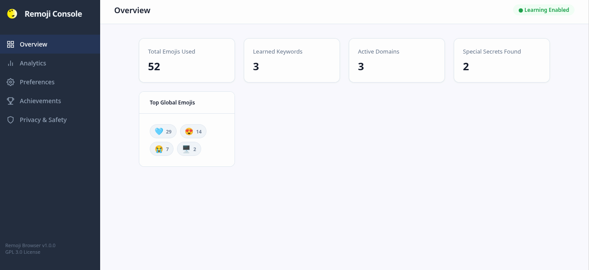
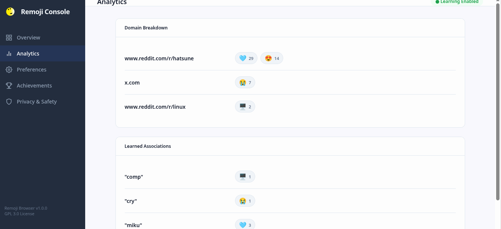
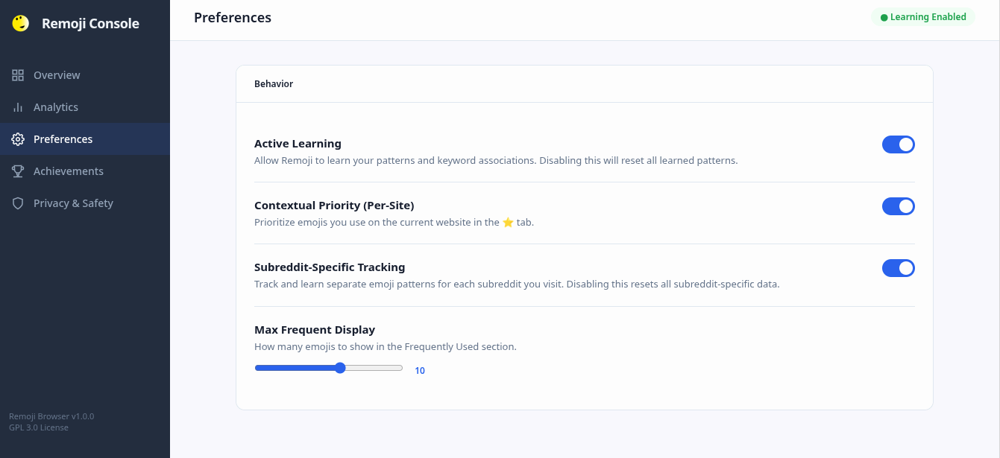
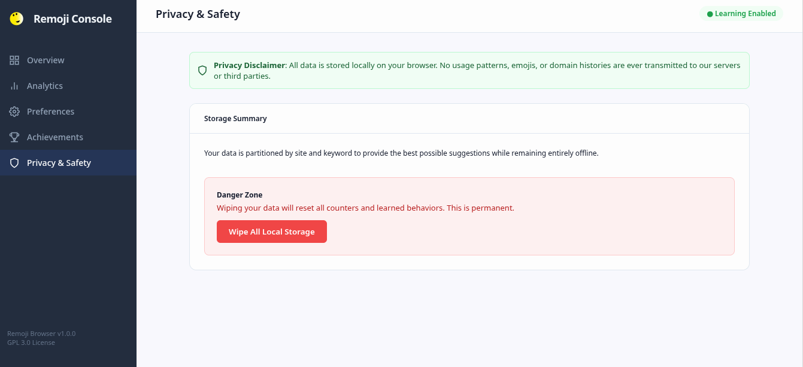
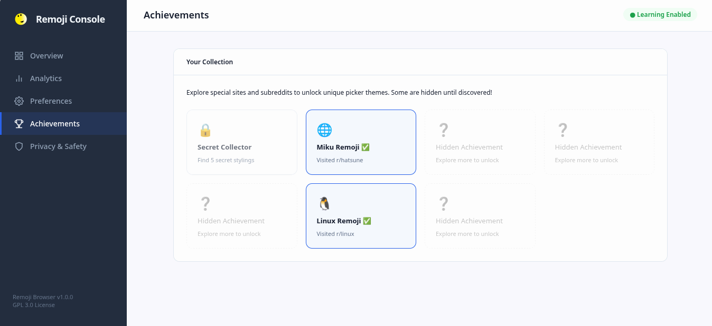
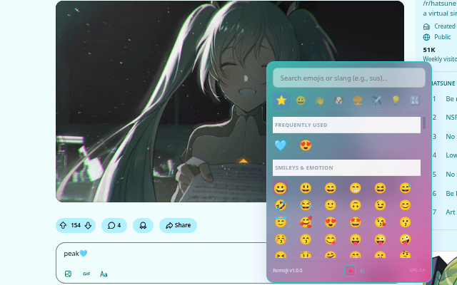
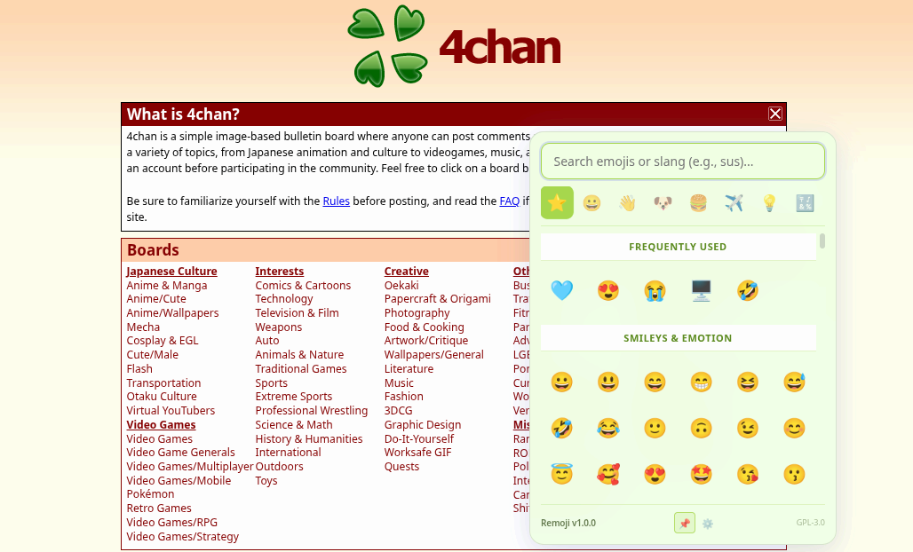
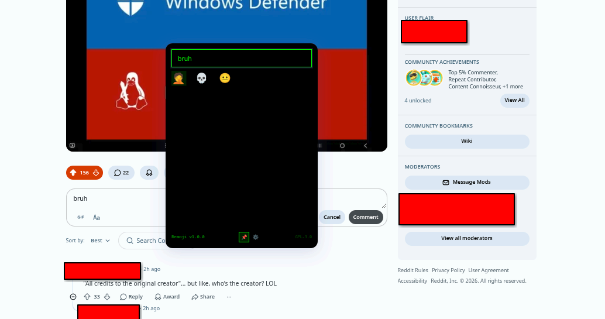
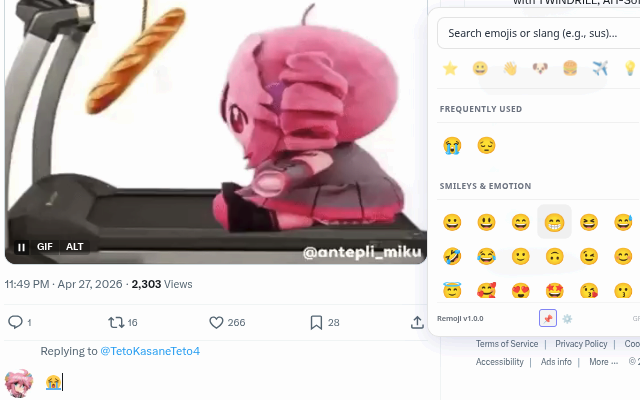

# Remoji Browser Extension ✨

Available in:

Microsoft Edge Addons (SOON)

> [!IMPORTANT]
> This extension was made with artificial intelligence. I, the developer, am simply the middleman between the AI and the user. I verify the code did not contain any suspicious instructions. However, if there's any security issues, submit a report and i'll try to fix it.

A blazing-fast, privacy-first, and intelligent emoji picker for your browser that learns how you type.

Remoji is more than just a standard emoji picker. It adapts to your specific usage patterns, understands modern internet slang, features site-aware contextual suggestions, and hides a fun, gamified collection of themes based on the communities you visit!

### Reasons why this exists

On Linux, i was tired of using the default KDE Emoji, no offense it's good and all, but intuitive it is not. Because when i try to select an emoji, i can't make the picker act like a keyboard for emoji to seamlessly integrate, the user has to do most of the labor. So i thought, why not create my own ?

---

## 🌟 Key Features

*   **⚡ Lightning Fast & Draggable**: Access your emojis instantly via the `Ctrl + .` (or `Cmd + .`) shortcut. Grab the search bar to drag the picker anywhere on your screen.
*   **🧠 Local Learning Engine**: Remoji learns which emojis you use most frequently. It tracks your habits *locally*, adjusting its "Frequently Used" tab dynamically.
*   **📍 Context-Aware & Subreddit Tracking**: Emojis you spam on Discord might not be the same ones you use on Reddit. Remoji can track your emoji usage *per domain* and even *per subreddit*, providing hyper-relevant suggestions based on where you are.
*   **🔍 Advanced Fuzzy Search**: Don't know the exact name of an emoji? Search for slang, emoticons, or concepts! Searching for `:3`, `sus`, `based`, `chad`, `miku`, or `ratio` will bring up exactly what you're looking for.
*   **📌 Pinned Mode (Aggressive Usage)**: Click the **Pin (📌)** icon to keep the picker open after selecting an emoji. Perfect for spamming a wall of 🧣🧣🧣.
*   **🎮 Gamified Easter Eggs**: Visiting specific websites and subreddits unlocks beautiful, custom CSS themes. Collect them all and view your progress in the Remoji Console!
*   **🛡️ 100% Privacy First**: Everything happens directly in your browser. There are no servers, no telemetry, and no data tracking. Your typing habits never leave your computer.

---

## 📸 Screenshots

### The Remoji Console
Manage your data, view your analytics, and track your achievements securely.

| Overview Dashboard | Analytics Breakdown |
| :---: | :---: |
|  |  |

| Preferences | Privacy & Safety |
| :---: | :---: |
|  |  |

### 🏆 Achievement System & Secret Themes
Unlock special visual themes by visiting hidden trigger sites and subreddits! Track your collection in the Achievements tab.

  

| Hatsune Miku (r/hatsune) | Zundamon (4chan) |
| :---: | :---: |
|  |  |

| Linux Master Race (r/linux) | Twitter/X |
| :---: | :---: |
|  |  |

*(And many more secret themes like Discord, Instagram, Megurine Luka, Kasane Teto, etc...)*

---

## 🛠️ Usage

1. Focus on any text input box (chat, comment section, search bar, etc.).
2. Press **`Ctrl + .`** to open Remoji.
3. Start typing to use the fuzzy search, or click your most frequent emojis at the top.
4. (Optional) Drag the top of the picker to move it out of your way.
5. (Optional) Click the **Pin** icon if you want to insert multiple emojis without the picker closing.

### Managing Your Data
Click the **Gear (⚙️)** icon in the footer of the picker to open the **Remoji Console**. Here you can:
*   View your global and site-specific emoji analytics.
*   Toggle features like **Active Learning**, **Contextual Priority**, and **Subreddit-Specific Tracking**.
*   View your unlocked Easter Egg themes.
*   **Wipe all your local data** instantly if you want a fresh start.

---

## 📄 License
Licensed under the **GPL-3.0 License**. Free and open-source forever.

## 📝 Troubleshooting 

If the extension is not working, try one of the following:
1. Try reloading your current page.
2. If it still doesn't work, try restarting your browser.

## Data Privacy Disclaimers

### ⚠️ Context-Aware Features

The extension has features that allow it to track your emoji usage on different websites and subreddits. It uses this data to provide you with relevant emoji suggestions based on your current context.

The AI Used on the Context-Aware features is not exactly like the LLMs you know today, it is a lightweight model that is hard-coded in the extension and does not have any connection to any external servers. It only checks for keyword patterns and emoji usage, and nothing else. To be exact, it only checks for patterns that are related to your interactions with the extension itself. No Gemini nor Claude is inserted in the codebase.

However, this data is only stored **locally** and is **NOT shared with anyone**. You can disable these features in the settings if you are not comfortable with them.

You can also check the source code to verify this.

### ⚠️ Data Collection

The extension collects the following data:
1. Your emoji usage patterns
2. Your website visits
3. Your subreddit visits
4. Your search queries